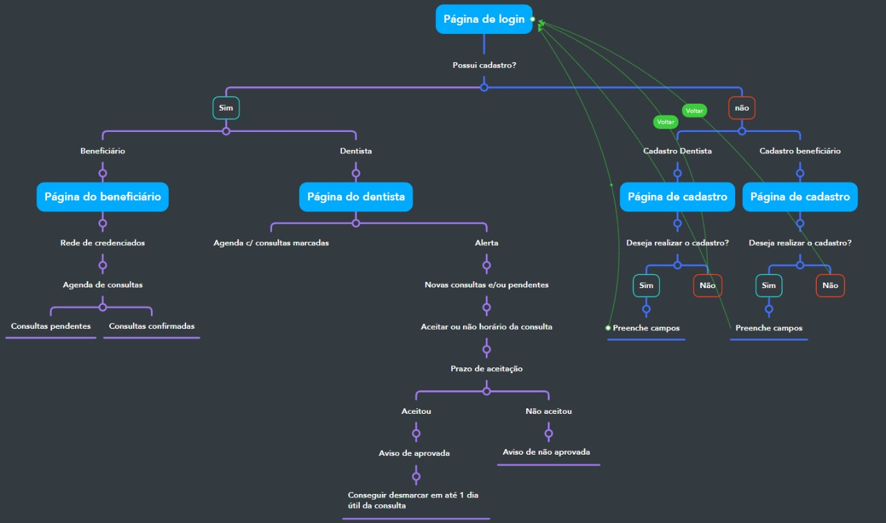

 

  

<h3 align="center">Talent Fest -  Odontoprev</h3>

  

     
    <a href="https://ellencavalcantebrito.github.io/TF_odontoprev/"><strong>Explore o projeto »</strong></a>

   
  
  *Status do Projeto:* Concluído 
     
     
     <a href = "mailto:odontoprev1.tf@gmail.com">Reportar um bug</a>
    ·
    <a href = "mailto:odontoprev1.tf@gmail.com">Solicitar alteração</a>
  

## Sumário
* [1. Sobre o Projeto](#1-sobre-o-projeto)
* [2. Aplicação](#2.aplicação)
  * [2.1. Tecnologias Utilizadas](#2.2-tecnologias-utilizadas)
  * [2.2. Banco de dados](#2.3-Banco-de-dados)
  * [2.3. Fluxograma](#2.3-fluxograma)
* [3. Protótipo](#3-protótipo)
* [4. Contribuindo](#4-contribuindo)
* [5. Contato](#5.contato)

 

## 1. Sobre o projeto

Este projeto foi desenvolvido durante o bootcamp da Laborátoria - turma SAP008, no talent fest. E tem como objetivo a criação de uma aplicação para facilitar o agendamento de consultas para beneficiários e credenciados da empresa Odontoprev.

<b><h3>Necessidades e objetivos:</b></h3>
<b>Beneficiário:</b> Acesso a rede de credenciados, escolher por região o dentista e agendar a consulta. 
E verificar as consultas já agendadas.

<b>Credenciados:</b> Página para visualizar os pedidos de consultas pendentes e também visualizar as consultas já confirmadas ou canceladas.

O projeto foi construído como web first e projetado em três dias,  por code review e live code e desenvolvido por: Alana Cardoso, Barbara Scatolin, Ellen Cavalcante, Gleyciane Macena, Nathalia Rigo, Thaina Prado.

 

### 2.1. Tecnologias Utilizadas

  -  `HTML`

  -  `CSS`

  -  `Javascript`

  -  `NodeJs`

  -  `Github`

  - `Figma`

 

### 2.2. Banco de dados
 Firebase 

 

### 2.3. Fluxograma
Iniciamos o projeto após receber a solicitação do cliente e com isso fizemos o primeiro fluxograma das telas de aplicação, para entender a lógica que deveria ser criada e com isso definir as tasks para a equipe de desenvolvedoras iniciar o projeto.
A organização das tarefas foi feita através do Trello, por 'baby steps' de ações a serem inseridas na aplicação.

 

## 3. Protótipo
Realizamos o protótipo no figma de acordo ao desafio proposto pela odontoprev, sendo web first.

<b><h3>Protótipo alta fidelidade - Web:</h3></b>

• Tela de Login 
 

• Tela de Cadastro 
 

• Tela do Usuário Beneficiário 
 

• Tela do Usuário Dentista 
 

 

## 4. Contribuindo

1. Solicite a mudança ao time responsavel 
2. Crie sua feature branch (`git checkout -b feature/newFeature `)
3. Faça o commite das mudanças (`git commit -m 'Add some newFeature'`)
4. Faça um push para a branch (`git push origin feature/newFeature`)
5. Abra um pull request 

 

## 5. Contato

* Alana Cardoso: [Linkedin](https://www.linkedin.com/in/alana-karine/) | [GitHub](https://github.com/AlanaK2)
* Barbara Scatolin: [Linkedin](https://www.linkedin.com/in/barbara-scatolin/) | [GitHub](https://github.com/oxibarbara)
* Ellen Cavalcante: [Linkedin](https://www.linkedin.com/in/ellencavalcantebrito/) | [GitHub](https://github.com/EllenCavalcanteBrito)
* Gleyciane Macena [Linkedin](https://www.linkedin.com/in/gleyciane-macena-costa/) | [GitHub](https://github.com/Gleyciane-Macena)
* Nathalia Rigo: [Linkedin](https://www.linkedin.com/in/nathaliarigo/) | [GitHub](https://github.com/ncrigo)
* Thaina Prado: [Linkedin](https://www.linkedin.com/in/thaina-prado-893b3b102/) | [GitHub](https://github.com/Thainaprado7)

[⬆ Voltar ao topo](https://github.com/EllenCavalcanteBrito/TF_odontoprev) 

[forks-shield]: https://img.shields.io/github/forks/github_username/repo_name.svg?style=for-the-badge
[forks-url]: http://git.odontoprev.com.br/cadastro/CadFat/api-beneficiario2.0/network/members

[stars-shield]: https://img.shields.io/github/stars/github_username/repo_name.svg?style=for-the-badge
[stars-url]: http://git.odontoprev.com.br/cadastro/CadFat/api-beneficiario2.0/stargazers

[issues-shield]: https://img.shields.io/github/issues/github_username/repo_name.svg?style=for-the-badge
[issues-url]: http://git.odontoprev.com.br/cadastro/CadFat/api-beneficiario2.0/issues

[license-shield]: https://img.shields.io/github/license/github_username/repo_name.svg?style=for-the-badge
[license-url]: http://git.odontoprev.com.br/cadastro/CadFat/api-beneficiario2.0/blob/master/LICENSE.txt

[linkedin-shield]: https://img.shields.io/badge/-LinkedIn-black.svg?style=for-the-badge&logo=linkedin&colorB=555
[linkedin-url]: https://linkedin.com/in/linkedin_username

[product-screenshot]: images/screenshot.png
[Next.js]: https://img.shields.io/badge/next.js-000000?style=for-the-badge&logo=nextdotjs&logoColor=white
[Next-url]: https://nextjs.org/

[React.js]: https://img.shields.io/badge/React-20232A?style=for-the-badge&logo=react&logoColor=61DAFB
[React-url]: https://reactjs.org/

[Vue.js]: https://img.shields.io/badge/Vue.js-35495E?style=for-the-badge&logo=vuedotjs&logoColor=4FC08D
[Vue-url]: https://vuejs.org/

[Angular.io]: https://img.shields.io/badge/Angular-DD0031?style=for-the-badge&logo=angular&logoColor=white
[Angular-url]: https://angular.io/

[Svelte.dev]: https://img.shields.io/badge/Svelte-4A4A55?style=for-the-badge&logo=svelte&logoColor=FF3E00
[Svelte-url]: https://svelte.dev/

[Laravel.com]: https://img.shields.io/badge/Laravel-FF2D20?style=for-the-badge&logo=laravel&logoColor=white
[Laravel-url]: https://laravel.com

[Bootstrap.com]: https://img.shields.io/badge/Bootstrap-563D7C?style=for-the-badge&logo=bootstrap&logoColor=white
[Bootstrap-url]: https://getbootstrap.com
[JQuery.com]: https://img.shields.io/badge/jQuery-0769AD?style=for-the-badge&logo=jquery&logoColor=white
[JQuery-url]: https://jquery.com 

[JBoss.com]: https://img.shields.io/badge/Jboss-Jboss-orange
[JBoss-url]: https://www.redhat.com/en

[Weblogic.com]: https://img.shields.io/badge/Weblogic-Weblogic-yellowgreen
[Weblogic-url]: https://www.oracle.com/br/java/weblogic/

[Java8]: https://img.shields.io/badge/Java-8-blue?style=for-the-badge&logo=buymeacoffee&logoColor=white
[Java8-url]: https://www.java.com/pt-BR/

[SpringBoot]: https://img.shields.io/badge/SpringBoot-6DB33F?style=for-the-badge&logo=springboot&logoColor=white
[SpringBoot-url]: https://spring.io/

[Hibernate]: https://img.shields.io/badge/Hibernate-59666C?style=for-the-badge&logo=hibernate&logoColor=white
[SpringBoot-url]: https://hibernate.org

[Oracle]: https://img.shields.io/badge/Oracle-F80000?style=for-the-badge&logo=oracle&logoColor=white
[Oracle-url]: https://www.oracle.com/

[DbPort]: https://img.shields.io/badge/1332-blue?style=for-the-badge

[DbVersion]: https://img.shields.io/badge/v12.3-green?style=for-the-badge

[AppPort]: https://img.shields.io/badge/3000-blue?style=for-the-badge
[Localhost]: https://img.shields.io/badge/Localhost-orange?style=for-the-badge

[Swagger]: https://img.shields.io/badge/Swagger-85EA2D?style=for-the-badge&logo=swagger&logoColor=white
[Swagger-url]: http://localhost:3000/portalempresa-cadastroOnline-pj/swagger-ui.html#
